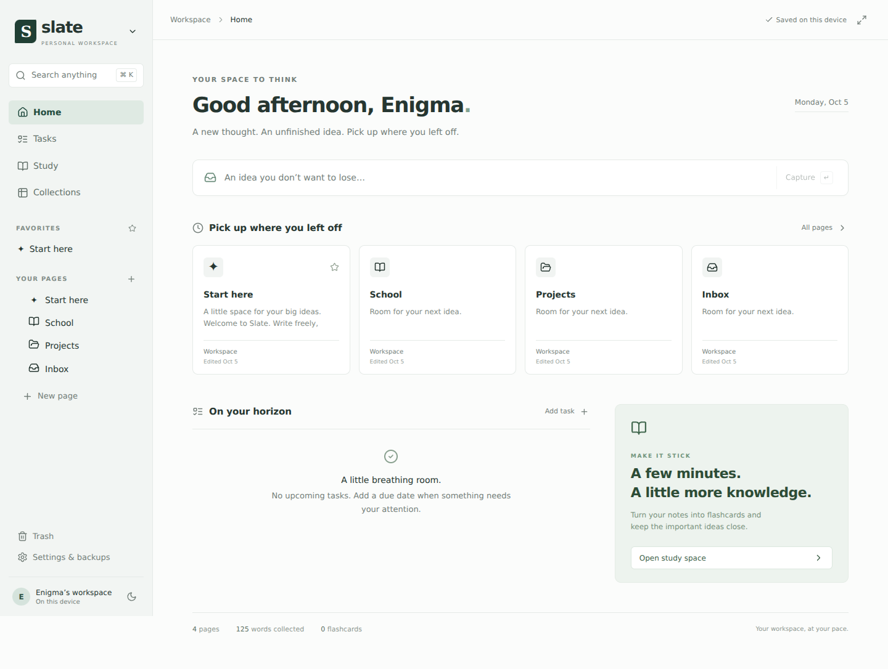

# Slate

An offline personal workspace for notes, coursework, projects, tasks, and study cards, where your notes quiz you back.

**No account, server subscription, or AI API key is required.** Notes live on your device. The included ChatGPT workflow uses copy and paste with your existing ChatGPT plan.



## Start using it

Open the hosted app: https://owuorbruce.github.io/myself-/

The ZIP includes the source and a ready-built `dist/` folder. Unzip the entire folder first.

### Run locally on Windows or Linux

1. Install **Node.js 22.13 or newer** if it is not already installed: https://nodejs.org/
2. On Windows, double-click **start-slate.cmd**. On Linux, run `sh start-slate.sh` from the Slate folder. On macOS, run `node run-slate.mjs`.
3. Your browser opens **http://localhost:4173/**. Keep the launcher window open while you use Slate.
4. Use the browser menu to install Slate as an app. Chrome and Edge support desktop installation; browser options vary.

The prebuilt copy runs without `npm install` and without an internet connection. After installation and caching, the app also reopens offline. The local launcher binds only to your computer's loopback interface.

Always use the same address, **http://localhost:4173/**, for your local workspace. `127.0.0.1`, another port, another browser, or a GitHub Pages URL uses a different workspace. Export and restore a backup when moving between them.

### Host on your GitHub account

1. Create a GitHub repository, for example **slate**.
2. Upload the **contents** of this folder into the repository root, including `.github/workflows/pages.yml`, `package.json`, `package-lock.json`, and `src/`.
3. Use `main` as the default branch. If you use another branch, edit the workflow's branch name.
4. In the repository, open **Settings → Pages → Build and deployment → Source → GitHub Actions**.
5. Open **Actions** and run **Deploy Slate to GitHub Pages**, or push a commit to `main`.
6. Open the URL reported by the deployment. Visit it online once, then install it from your browser.

The workflow detects the GitHub Pages base path, builds Slate, runs the validation tests, and publishes only the app files. It supports project repositories, account Pages repositories, and configured custom domains.

By default, notes and attachments stay in this browser's IndexedDB storage. GitHub Pages distributes only the app code. If you enable optional sync, Slate also uploads notes and attachment bytes to the private GitHub repository you choose.

GitHub setup documentation: https://docs.github.com/en/pages/getting-started-with-github-pages/configuring-a-publishing-source-for-your-github-pages-site

## What you can do

| Area         | Features                                                                                                                                     |
| ------------ | -------------------------------------------------------------------------------------------------------------------------------------------- |
| Writing      | Rich text, headings, bold, italic, underline, highlights, lists, checklists, quotes, callouts, code blocks, tables, images, links, dividers  |
| Organization | Nested pages, drag pages into other pages, move a page using its location selector, favorites, tags, child pages, inbox capture              |
| Navigation   | Search and command menu, page tabs, split view with two editors, outline, focus mode, backlinks                                              |
| Collections  | Editable custom fields: text, number, date, checkbox, select, URL; table, board, calendar agenda, list, gallery; assignment tracker template |
| Tasks        | Dedicated tasks with due dates, priority, and source pages; aggregated checklists from notes                                                 |
| Interactive  | Tap to Learn questions, fill-in-the-blanks, label-the-image diagrams with green / amber / red feedback, right inside your notes                |
| Teach me     | Turns any page into small teach-then-quiz bites with hearts, XP, pop quizzes and retries of what you missed                                  |
| Studying     | Daily 5-minute review, weak-spot tracking, study streak, spaced repetition for flashcards and quiz blocks, exam / definition markers          |
| Files        | Local attachments, image insertion, PDF and image preview, text/PDF attachment search, offline OCR for scans and photos                      |
| Sync         | Optional sync between phone and laptop through a private GitHub repository you own, with conflict copies                                      |
| Recovery     | Automatic snapshots, manual snapshots, restore history, trash and restore pages, full ZIP backup and restore                                 |
| Portability  | Notion export import, Markdown export and import (tables, `{{blanks}}`), structured JSON backup, attachment files included                   |
| Appearance   | Match my device, light, dark, sepia (moon button in the top bar); sans serif or serif editor; wide layout                                     |
| AI           | Preview/copy a grounded prompt for a page, selected text, or relevant notes; open ChatGPT; paste answers back yourself                       |
| Offline      | Notes, search, collections, checklists, tasks, flashcards, existing attachments, and backups                                                 |

## Learn by doing

Slate is built for people who'd rather tap than read a wall of text.

- **Tap to Learn.** Type `/tap` (or press the 👁 toolbar button). Write a question, then the answer underneath. The answer stays hidden until you tap.
- **Fill in the blank.** Select a word and press the blank button in the toolbar, or type `/blank`. Type your guess into the gap and press Enter. Green is right, amber is a near miss, red is wrong. Separate accepted answers with `|`, like `osteoclasts|osteoclast`.
- **Label the image.** Type `/label` and pick a diagram or lab slide. Drag boxes over its labels and type each answer. Press **Done**, then fill in the boxes and press **Check**. **Retry mistakes** clears only the wrong ones.
- **Teach me.** Press **Teach me** on any page. Slate splits it into sections (by heading) and small bites, quizzes you right after each bite, gives pop quizzes every few sections, and brings back what you miss. Your blanks, Tap to Learn questions, labelled images and **bold key terms** become the questions.
- **Study → Today.** A short daily review that puts your weak spots first, then anything due. Answer one question a day to keep your streak.
- **Study → Weak spots.** Everything you've missed, worst first, with a button to practise just those.

Open **School → Interactive notes: example** in a new workspace, or press **Add an example page** in Study, to try it.

## A useful first session

- Open **School** and create a child page for a course.
- Create a **Class notes** page inside it.
- Type `/exam` on an empty line and choose **Exam marker** to flag a key idea.
- Open **Study → Marked material** to collect your marked concepts.
- Create a flashcard from a selection using **Flashcard** in the editor footer.
- Create a dated task using **Task** in the footer.
- Open **Collections**, create an assignment tracker, then add rows and choose a table or board view.
- Export a workspace backup in **Settings & backups**.

Starter pages contain no real assignments or deadlines. Rename or remove them as you wish.

## Sync between your phone and laptop

Sync is optional and uses a private GitHub repository you own, so there is still no Slate server.

1. Create a **private** repository on GitHub, for example `slate-notes`.
2. Create a [fine-grained token](https://github.com/settings/personal-access-tokens/new). Under **Repository access** choose **Only select repositories** and pick that repository. Under **Permissions → Contents** choose **Read and write**.
3. In Slate open **Settings & backups → Sync between your devices**, enter `your-name/slate-notes` and the token, and press **Connect and sync**.
4. Do the same on your other device. A fresh device takes your synced notes instead of adding a second set of starter pages.

Slate syncs when it opens, about 20 seconds after you edit, every 5 minutes, and when you switch away. The cloud button in the top bar syncs right away and shows the status. If the same page was edited on both devices before syncing, both versions are kept and the other one is named "(from other device)". Permanent deletions sync too.

The token is stored only in that browser's device storage. It is never put in backups or in the synced copy. Slate refuses to sync to a public repository.

## Import from Notion

In Notion, export with **Markdown & CSV** and **Include subpages** (Settings → Workspace → Export, or a page's ⋯ menu → Export). In Slate open **Settings & backups → Import a Notion export (.zip)**.

Pages keep their nesting, images, tables, callouts, checklists and links between pages. Other files become attachments. Databases become Collections, and their row pages are imported as pages. Everything lands under a page called **Imported from Notion**. Files over 25 MB are skipped.

## Read text in scans and photos

When you attach a photo or a scanned PDF, Slate reads the printed text on your device and makes it searchable. Use **Read text** / **Text** on an attachment to see it and **Put this text in the page**. Turn automatic reading off in Settings if you prefer.

The text reader (about 11 MB) downloads the first time it's used, then works offline. **Download text reading for offline use** in Settings fetches it ahead of time. It reads English printed text; handwriting is hit and miss.

## Ask ChatGPT using Plus

1. Open a note and click **Ask ChatGPT**.
2. Choose the page, highlighted selection, or relevant workspace notes. For workspace notes, enter a specific question to find matching sources.
3. Choose an action and inspect **Preview prompt**.
4. Click **Copy prompt**, then **Open ChatGPT**.
5. Paste the prompt into ChatGPT and use your existing plan.
6. Copy a response back into a note. For generated flashcards, ask for the JSON format and use **Import flashcard answers**.

Slate has no automatic ChatGPT login or subscription integration. It does not send notes to an AI service. It does not include an Ollama adapter or separately billed API integration. All AI work happens after you paste into ChatGPT. The normal limits of your ChatGPT plan still apply.

## Offline and storage

Slate uses IndexedDB for workspace records and attachment blobs, and a service worker to cache its complete application bundle. There are no remote fonts, CDNs, tracking scripts, or required servers in the note-taking workflow. Text extraction from digital PDFs and OCR of scans and photos also run locally.

Each page, its history, and the extracted text of each attachment are stored as separate records, so typing only rewrites the page you're editing. Workspaces from the first version of Slate are converted automatically the first time the new version opens.

After the first successful visit, the app shows **Offline ready** when its cache is installed. Test your own browser by turning off the network, closing and reopening Slate, and editing a note.

Browser storage is finite and can be removed by clearing site data or deleting a browser profile. Use **Request persistent storage** and export regular backups. Persistent storage requests are subject to the browser's decision. Backups are ordinary unencrypted ZIP files; store them wherever you keep your private documents.

Only one tab should edit a workspace at a time. Saves check a revision number so a stale tab cannot silently overwrite another tab. If you see a save conflict, export your unsaved work and reload before editing further.

## Reliability

- Connecting sync always keeps existing notes, including new and imported notes. Starter pages may remain alongside remote notes.
- Sync uses the last successful snapshot to merge tasks, cards and collection rows independently. Conflicting edits are retained as copies.
- Only exact answers or explicit `|` alternatives pass automatically; close spellings are hints and count as missed until corrected or explicitly self-approved. Numeric signs and decimal points are preserved.
- Reviews use the current blank answers and prompts. Deleted blanks and changed automatic questions leave the review queue.
- Restoring a backup marks it for sync and records deletions of replaced records. Changes made on another device can still be preserved as conflict copies.
- Missing, incomplete or failed attachment transfers stop sync and show an error before publishing the workspace.

## History and backups

- Changes autosave shortly after you edit; **Ctrl / Cmd + S** flushes immediately.
- Editing creates a snapshot of the previous version, at most once every five minutes.
- Each page keeps its most recent 30 snapshots. Use **Save a snapshot now** before a major rewrite.
- Trash retains pages and children until permanent deletion.
- A full backup includes active and trashed pages, versions, tasks, cards, collection data, settings, and attachment bytes.
- Restoring validates structure and references before changing anything, then replaces workspace and files in one IndexedDB transaction.
- Restore is a **replacement**, rather than a merge. Export your current workspace first if you need to keep it.

Backup layout:

```text
workspace.json           authoritative structured workspace
pages/<page-id>.md        portable text copies of pages
attachments/<file-id>    original attachment bytes
```

`workspace.json` retains attachment names and types. Internal filenames use stable IDs so duplicate titles and filenames cannot overwrite each other.

## Keyboard shortcuts

| Action              | Shortcut                                        |
| ------------------- | ----------------------------------------------- |
| Search and commands | Ctrl / Cmd + K                                  |
| New page            | Ctrl / Cmd + N                                  |
| Save immediately    | Ctrl / Cmd + S                                  |
| Focus mode          | Ctrl / Cmd + Shift + F                          |
| Insert block        | Type `/` at the beginning of an empty paragraph |
| Check a blank       | Enter                                           |
| Close a dialog      | Escape                                          |

Some browsers reserve new-window shortcuts; the visible New page button is always available.

## Develop or rebuild

```bash
npm ci
npm run dev
```

For a production build:

```bash
npm test
npm run build
node run-slate.mjs
```

`npm run build` generates an offline-capable app and service worker. Development mode is for source editing; test offline behavior against the production build.

Set `VITE_BASE_PATH=/your-repository/` while building if you serve a prebuilt copy at a subdirectory. The provided GitHub workflow sets this automatically. For local use, the default `./` base works.

### Structure

- `src/App.tsx`: workspace UI, page navigation, tasks, study, backups, save queue.
- `src/Editor.tsx`: Tiptap editor and slash commands.
- `src/blocks.tsx`: Tap to Learn, fill-in-the-blank and label-the-image editor blocks.
- `src/Learn.tsx`, `src/lesson.ts`: Teach-me mode and the review session.
- `src/study.ts`, `src/grading.mjs`: answer grading, spaced repetition, weak spots and streaks.
- `src/sync.ts`, `src/sync-merge.mjs`: GitHub sync and merging between devices.
- `src/notion.ts`: Notion export importer.
- `src/ocr.ts`: offline text recognition (Tesseract), served from `ocr/`.
- `src/Collections.tsx`: collection fields and shared views.
- `src/storage.ts`: IndexedDB storage split by page, revision checks, attachment IO, export/restore, migration.
- `src/validation.mjs`: backup and hierarchy validation.
- `src/extensions.ts`: custom callout and page-link nodes.
- `src/markdown.ts`: Markdown importer.
- `src/pdf.ts`: lazy-loaded local PDF text extraction.
- `vite.config.ts`: app build, manifest, full offline caching.
- `.github/workflows/pages.yml`: GitHub Pages deployment.
- `run-slate.mjs`: dependency-free localhost launcher for the prebuilt app.

## Current boundaries

This version is a personal workspace. It has no real-time collaboration, native Windows/Linux installer, encrypted storage, collection formulas/relations, handwriting recognition, semantic/vector search, or automatic AI execution. Its installable app is a PWA. Sync needs a GitHub account and a private repository.

Calendar is a date-grouped agenda view. Reviews use an SM-2 style spaced repetition schedule rather than a full Anki/FSRS engine. Teach me builds questions from your own notes; it doesn't write explanations of its own. Markdown import covers headings, basic formatting, lists, checklists, quotes, links, and fenced code; more elaborate Markdown constructs are kept as text. Imported remote images are not fetched automatically.

Attachment limit: 25 MB each. Inline image limit: under 5 MB. PDF indexing: up to 300 pages and 1 million text characters; larger PDFs remain attached without full indexing. Backup restore: under 200 MB compressed and total attachment bytes. Structured backup text is limited to 30 MB. These are client-side guardrails, not paid credits.

## License

The project code is released under the MIT License. Dependencies keep their own licenses.

